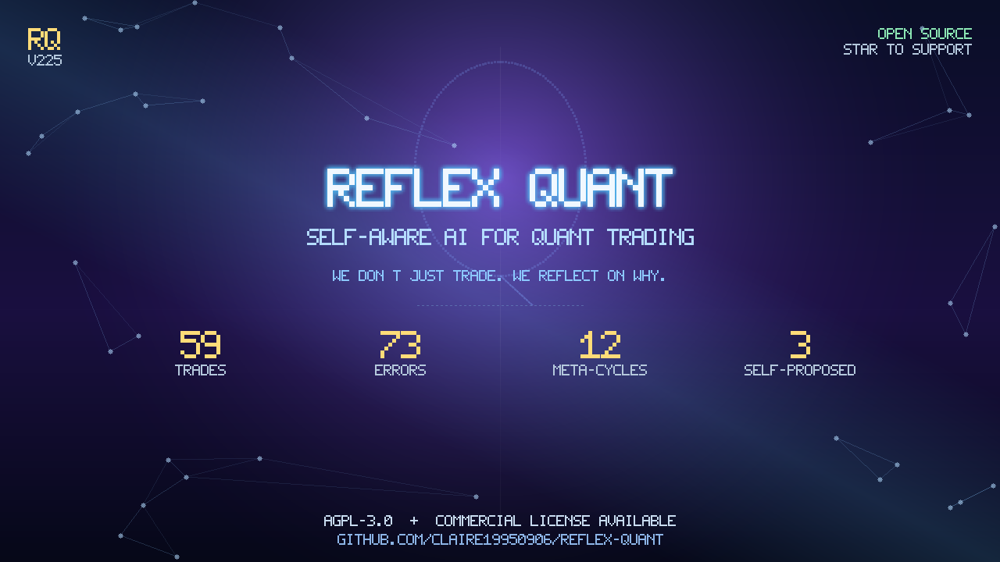

# Reflex Quant 🪞
### *The self-reflective AI for quant trading desks.*

[](./LICENSE)
[](#)
[](./docs/CASE_STUDIES.md)
[](./docs/ARCHITECTURE.md)
[](./docs/PHILOSOPHY.md)
[](#)
[](./.github/workflows/codeql.yml)
[](./.github/dependabot.yml)
[](https://github.com/Claire19950906/reflex-quant/commits/main)
[](https://github.com/Claire19950906/reflex-quant)
[](https://github.com/Claire19950906/reflex-quant)
[](./showcase/index.html)
[](https://github.com/Claire19950906/reflex-quant/actions/workflows/pages.yml)
[](https://github.com/Claire19950906/reflex-quant/actions/workflows/codeql.yml)
[](https://github.com/Claire19950906/reflex-quant/stargazers)
[](https://github.com/Claire19950906/reflex-quant/network/members)

> **One-line pitch:** Reflex Quant is a self-aware quant AI that not only trades,
> but reflects on every decision — catching **27 classes of reasoning errors** no
> human PM has time to spot.

[Why Reflex Quant](#-why-reflex-quant) · [Architecture](#-architecture) ·
[Case studies](./docs/CASE_STUDIES.md) · [Philosophy](./docs/PHILOSOPHY.md) ·
[Roadmap](./docs/ROADMAP.md) · [FAQ](./docs/FAQ.md) · [Launch kit](./docs/LAUNCH_KIT.md)

---

<p align="center">
  <a href="./assets/banner.png"></a>
</p>


> 📺 **5-second demo:** see the live signal feed in action — [`showcase/media/demo.gif`](./showcase/media/demo.gif).
> 🎬 **Interactive showcase:** open [`showcase/index.html`](./showcase/index.html) in any browser. Click around. All data is synthetic.
> 📸 **Screenshot library:** [`assets/screenshots/`](./assets/screenshots/) — six PNGs ready for pitch decks.
> 🪞 **Repo banner (16:9, 1280×720):** [`assets/banner.png`](./assets/banner.png) — use in pitch decks, talks, social cards.
> ✍️ **Social bios & copy bank:** [`docs/SOCIAL_BIOS.md`](./docs/SOCIAL_BIOS.md) — ready-to-paste copy for GitHub, LinkedIn, Twitter, Product Hunt, HN, and cold email.
>
> 🚀 **Launch kit (Twitter thread + HN Show + Reddit + 中文版):** [`docs/LAUNCH_KIT.md`](./docs/LAUNCH_KIT.md) — full Day-0 launch drafts + 30-day calendar.

---

## 🎯 The problem

Every quant desk has the same hidden leak:

> *PMs spend 80% of their day **watching** trades, and 20% **thinking** about why trades work or fail.*

Tools like Bloomberg, MetaTrader, or QuantConnect give you **execution and backtest**.
None of them tell you:

- *Why did the WTI short last Tuesday lose money?*
- *Is the LLM consistently skipping the cross-asset check?*
- *Are you over-confident on low-evidence trades?*

The "reflection" step — the most valuable 20% — is done in heads, in Notion pages,
in weekly meetings, and **in retrospect, after the damage is done.**

---

## 💡 Our solution

Reflex Quant is an **open-source quant trading stack with a built-in self-reflection engine.**

Three pieces, end-to-end:

1. **Real-time signal engine** — news → LLM filter → signal → 2-hour forward validation → WIN/LOSS settle.
2. **27-layer error checker** — every signal is audited across **7 reflection layers**. Each error code (E001–E027) has explicit remediation guidance.
3. **Meta-reflection loop** — the system **reflects on its reflections**. When all 7 reasoning-logic checkers miss a bad trade, Reflex logs the *blindspot of the blindspot* and proposes a new checker (E028+).

> The moat: a quant system that gets **more honest about itself over time**, instead of less.

---

## 🪞 Why Reflex Quant

Most quant systems are *confident machines*: bigger models, more data, more leverage.

Reflex Quant is a *self-aware machine*. We bet on three structural advantages:

| Capability | Reflex Quant | Bloomberg | MetaTrader | QuantConnect |
|---|:---:|:---:|:---:|:---:|
| Self-host / OSS | ✓ | ✗ | partial | ✓ |
| Real-time LLM signals | ✓ | ✗ | ✗ | ✗ |
| 27-layer reflection | ✓ | ✗ | ✗ | ✗ |
| Meta-loop (reflects on reflection) | ✓ | ✗ | ✗ | ✗ |
| Cross-asset inverse-pair aware | ✓ | ✗ | ✗ | ✗ |
| Cron-automated KG + alerts | ✓ | partial | ✗ | ✗ |
| Open-source | ✓ | — | — | partial |
| Local-first (no cloud) | ✓ | ✗ | ✓ | ✓ |
| Price / mo | **$499** | $2k+ | $0–$200 | $0–$100 |

> **No existing product offers built-in reasoning-quality reflection for live LLM-driven trades.**---

## 🏗 Architecture (TL;DR)

```
News (FinancialJuice WS / TreeNews) ─┐
                                     ▼
        L1 keyword + L2 LLM filter (realtime_filter.py)
                                     ▼
                       raw_news  (SQLite + WAL)
                                     ▼
              LLM analysis (Kimi K3 via OpenRouter)
                                     ▼
                       ai_decisions  (signals)
                                     ▼
              2h forward validation  (forward.py)
                                     ▼
              ┌──────────────────────────────────────────┐
              │  27-layer reflection engine              │
              │   (reflection_checkers.py)               │
              │   → decision_errors   (E001–E027)        │
              │   → review_insights   (KG nodes)         │
              │   → reflection_cycles (meta-loop)        │
              │   → blindspot log    (META_REFLECTION.md)│
              └──────────────────────────────────────────┘
                                     ▼
                Next.js frontend + Feishu alerts + cron L3 automation
```

The **bottom row is what doesn't exist anywhere else in the quant world** — a self-aware system that writes its own improvement log.

📚 For design philosophy and deep architecture, see [docs/PHILOSOPHY.md](./docs/PHILOSOPHY.md) and [docs/ARCHITECTURE.md](./docs/ARCHITECTURE.md).

---

## 📊 Proof points (as of v225)

- **59 paper trades** closed in 7 days, full audit trail
- **27 error codes** across **7 reflection layers** (`event_logic`, `causal`, `sample_integrity`, `reasoning_logic`, …)
- **8 reasoning sub-layers**: `assumption`, `counterfactual`, `calibration`, `history`, `cross_asset_consistency`, `mechanism`, `confidence_evidence`
- **Cross-asset inverse-pair awareness** — refuses to flag "XAU ↑ + DXY ↓" as inconsistent
- **Meta-loop blindspot detection** — when 7 reasoning-logic checkers all miss, Reflex logs the case and proposes an E028+ checker
- **Auto-rotate backups** before any data reset
- **43 pytest cases** — all offline, CI-ready
- **Cron-driven L3 automation** — daily KG review (04:00), causal expansion (04:10), 10-min scheduler
- **WAL truncate** + **lazy degradation** — safe to run unattended

📚 See [docs/CASE_STUDIES.md](./docs/CASE_STUDIES.md) for full case walkthroughs.

---

## 💼 Business model (provisional)

We are evaluating two paths. **Will pick one with the first 5 customers.**

| Route | Who pays | Pricing | Gross margin |
|---|---|---|---|
| **A. Self-hosted license** | Independent quants, family offices | $499 / desk / mo | ~85% |
| **B. Reflection-as-a-Service** (API) | Other quant startups | $0.05 / decision audited | ~70% |
| **Hybrid** | OSS community + paying tiers | Free / $499 / usage | mixed |

Target payback: 6 months. Target LTV: $6k–$30k per desk.

---

## 🛣 Roadmap

| Phase | Version | Time | Goal |
|---|---|---|---|
| **Now** | v225 | ✅ | Paper trading, 27-layer reflection, meta-loop |
| **Next 30 days** | v230 | days 0-30 | Live-trading testnet (Binance), 5-month live track record |
| **60 days** | v235 | days 30-60 | 1st paying pilot (quant fund, $5k MRR), public case study |
| **90 days** | v240 | days 60-90 | $20k MRR, 3 customers, GitHub 100+ stars |
| **6 months** | v250 | day 180 | $50k MRR, 10 customers, Series Seed deck |
| **12 months** | v300 | day 365 | AUM > $5M or 50M API decisions audited, Series A |

📚 Full roadmap + open items: [docs/ROADMAP.md](./docs/ROADMAP.md)---

## 🧬 What makes us different

- **The reflection log is open-source.** Other systems have logs; we have a *self-improvement diary*.
- **Tools expose uncertainty, not decide for you.** We refuse to make the AI black-box.
- **Cron-automated, not "AI assistant" wannabe.** The system *runs* itself; you don't chat with it.
- **Built for the 80%, not the 1%.** Citadel doesn't need this. Independent quant with $5M AUM does.

---

## 📦 What's in this repo

This is the **public showcase repository**. It contains:

- 📚 **`docs/`** — Design philosophy, architecture principles, case studies, FAQ
- 🎨 **`frontend/`** — UI components (read-only, no backend wiring)
- 📁 **`examples/`** — Sample case studies in markdown
- 🎬 **`showcase/`** — Link to the live interactive HTML demo

The **full source code** (backend, engine, KG builder, reflection checkers, prompt
templates, model weights) lives in our **private repository**. Code is opened up
incrementally under the [LICENSE](./LICENSE) terms below.

### 📜 Licensing

This project uses a **dual-license**:

- **AGPL-3.0** for open-source use — community-source individuals, academic
  research, internal company use (no SaaS reselling)
- **Commercial License** required for: SaaS products, hosted offerings,
  white-label reselling, embedding in proprietary trading systems

See [LICENSE](./LICENSE) for AGPL-3.0 full text and [LICENSE-COMMERCIAL.md](./LICENSE-COMMERCIAL.md)
for commercial terms.

> **Why dual license?** We love open-source. We also need to pay our team.
> The reflection engine framework + UI is genuinely free for community use;
> commercial players pay a license that funds the next round of open development.

---

## 👥 Team

*(fill in — placeholder)*

| | Background |
|---|---|
| **Founder / CEO** | [Name], [background: e.g. 6 yr crypto quant, ex-…] |
| **CTO** | [Name], [background] |
| **Quant Lead** | [Name], [background] |
| **Advisor** | [Quant fund PM] |
| **Advisor** | [OSS founder] |

---

## 📬 Get in touch

- **Email:** team@reflex-quant.ai
- **Demo:** [calendly.com/reflex-quant](https://calendly.com)
- **Twitter:** [@reflexquant](https://twitter.com/reflexquant)
- **Discord:** [discord.gg/reflex-quant](https://discord.com)

---

<sub>v225 — 2026-10-06 — built with the assumption that the next decade of
quant will be defined not by who has the most data, but by who has the most
honest system.</sub>