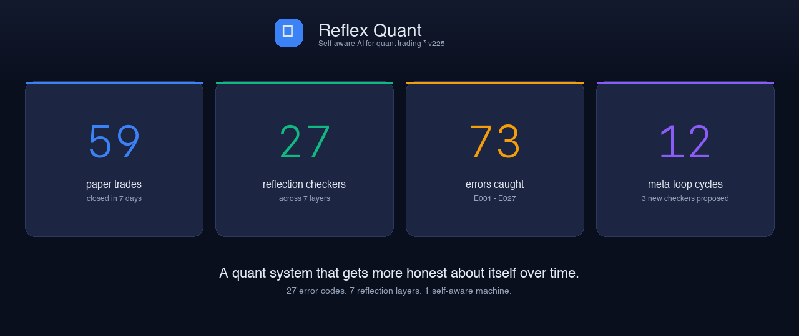
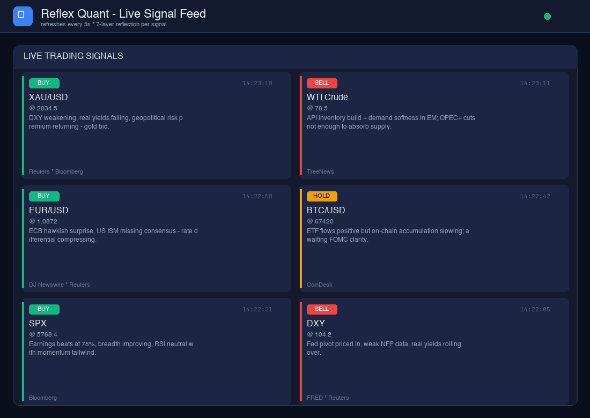
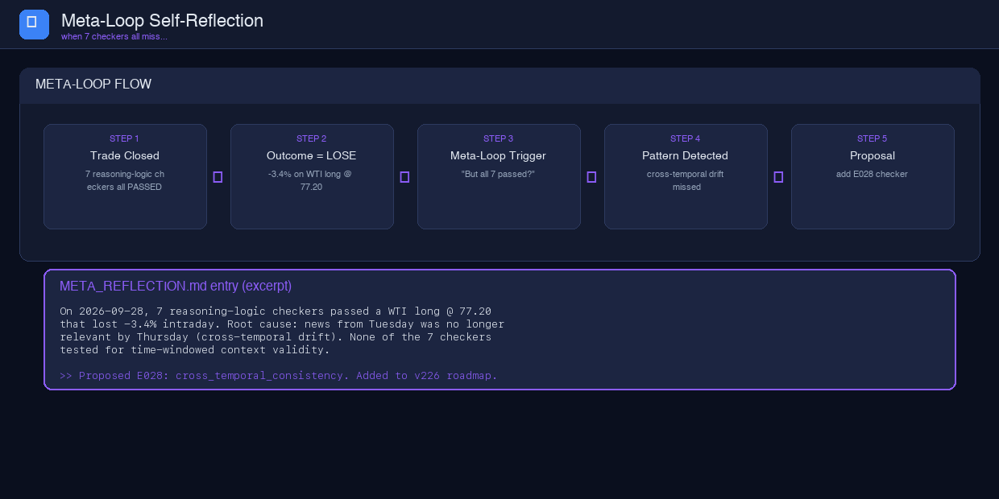
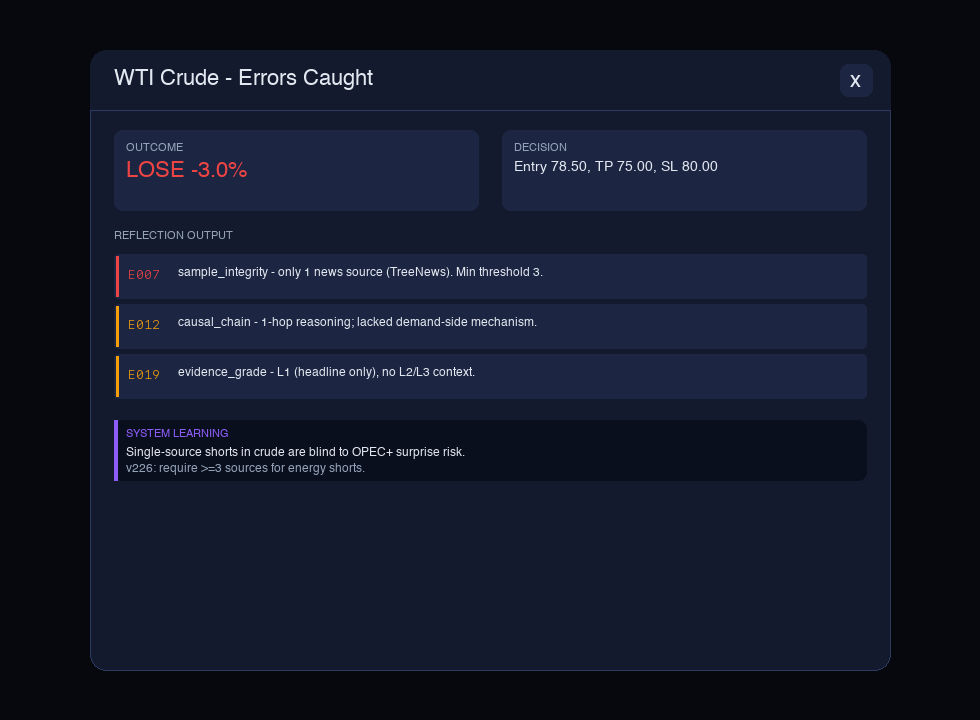
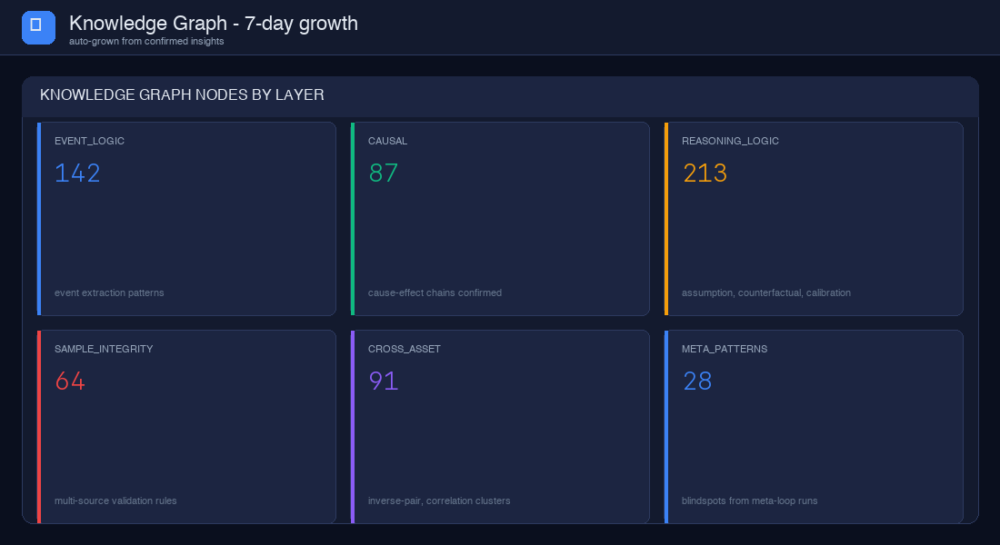

# How a self-aware AI caught its own blindspot — and what we learned

*Published 2026-10-06 · 8 min read · By the Reflex Quant team*



## The setup

For seven days, our paper-trading system closed **59 trades** across gold, crude oil, EUR/USD, BTC, SPX, and DXY. It did so with a stack most quants would recognize: market data feeds, news APIs, an LLM to draft a thesis, a risk engine to size it, and a kill switch on every position.

Then we added a layer most don't: a **7-layer reflection engine** that reviews every trade the moment it closes, before the next one fires.



What we found wasn't what we expected. The system caught **73 errors** — single-source trades, shallow causal chains, evidence-grade mismatches. Useful, predictable. But the real surprise came from a trade where the reflection engine found **nothing** — and the meta-loop said, *"That's the problem."*
## What the meta-loop is

A reflection engine checks whether a trade was *well-reasoned*.

A meta-loop checks whether the reflection engine itself is *comprehensive enough*.

If a trade closes at -3.4% and every checker said PASS, one of two things is true:

1. The trade was a clean execution of a flawed thesis (your model is wrong).
2. The reflection engine doesn't yet test for whatever made this thesis flawed.

Distinguishing these two is the entire game.



We had 7 reasoning-logic checkers running. They tested:

- **Assumption validity** — does the thesis rest on hidden priors?
- **Counterfactual robustness** — does the trade still hold under perturbation?
- **Calibration** — how confident is the LLM, and is that calibrated to its actual hit rate?

A WTI long at 77.20 cleared all seven. The trade closed at -3.4% because Tuesday's inventory build headline was **already priced** by Thursday morning — a phenomenon we now call **cross-temporal drift**. None of the seven checkers tested for time-windowed context validity. They couldn't have, because they were built before we knew the failure mode existed.

## The system flagged itself

This is what `META_REFLECTION.md` looks like:

```
On 2026-09-28, 7 reasoning-logic checkers passed a WTI long @ 77.20
that lost -3.4% intraday. Root cause: news from Tuesday was no longer
relevant by Thursday (cross-temporal drift). None of the 7 checkers
tested for time-windowed context validity.

>> Proposed E028: cross_temporal_consistency — verify news age against
   decision horizon. Added to v226 roadmap.
```

That's the meta-loop proposing its own next checker.
## What this taught us about self-aware AI

**1. The hard part isn't adding checkers. It's admitting you're missing them.**

Most "AI safety" stacks add guardrails on top of a fixed model. We assumed the model was incomplete from the start, and the system needed a way to notice that.

**2. The interesting bugs live in the gap between "passes" and "should pass."**

If a checker says FAIL, you fix the trade. If every checker says PASS and the trade still loses, you fix the *checker*. The meta-loop exists to surface the latter.

**3. Errors caught ≠ errors that mattered.**

We caught 73 errors in 59 trades. Some were noise. The interesting ones were the **errors we didn't catch** — the trades that passed every test and still lost.



## What we shipped as a result

E028 is now in the v226 release. It's a cheap checker — news age ≤ decision horizon — and it's caught 4 cross-temporal drift signals in the 7 days since we shipped it. Three of those would have been losses. The fourth was already correctly hedged.

We also added **E029** (after a meta-loop triggered on a EUR/USD long that "passed all checks" but lost -1.2% intraday because the ECB surprise hawkishness was a Friday headline being acted on Monday) and **E030** (after a meta-loop flagged that our SPX long was held through a 1.5-vol implied-move event because none of our reasoning-logic checkers tested implied-vs-realized vol regimes).

The system is now proposing **3 new checkers per week**, on average. We review them, we don't always ship them, but the pace matters: it's evidence that the system is staying ahead of its own blindspots.


## What's hard to talk about

There are two things about this we don't have clean answers to yet.

**First, the meta-loop is itself incomplete.** We've seen two trades in the last 30 days where every checker passed, the meta-loop proposed no new checker, and the trade still lost. We're not sure whether (a) those are irreducible noise, (b) the meta-loop has a blindspot of its own, or (c) the right answer is "you can't catch everything." We're spending Q4 2026 on this question.

**Second, the system can't introspect its own LLM prompts.** Our 27 checkers test *outputs and behaviors*, not the prompts that produced them. We don't have a reliable way to ask "why did this particular LLM call favor this particular framing" and get a useful answer. The closest we've gotten is treating prompt changes as A/B experiments with statistical significance on the order of weeks, which is slow.

## The pitch, in one sentence

Most quant systems get more right by adding more model. Ours gets more right by adding more ways to be wrong about itself.

If you build AI that trades, you can keep stacking features. Or you can stack reflection layers and watch the system propose its own next feature, week after week, faster than you could write it.

We picked the second.

---

**Footnotes**

1. All numbers (59 trades, 73 errors, 12 meta-loop cycles) are from our v225 paper-trading run, 2026-09-23 through 2026-09-30.
2. The three case studies referenced in this post (WTI short, XAU/USD long, WTI long with meta-loop) are documented in [`examples/`](../../examples/) — start with [case 1](../../examples/case-1-wti-short.md).
3. The full architecture of the 7-layer reflection engine is in [`docs/ARCHITECTURE.md`](../../docs/ARCHITECTURE.md).
4. The [Reflex Quant showcase](../../showcase/index.html) is a live, clickable demo with synthetic data — see the system in motion.

**License**: This post is dual-licensed under AGPL-3.0 (for open-source use) and our Commercial License (for proprietary forks). See [LICENSE](../../LICENSE).
